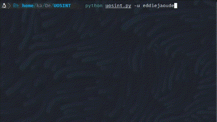
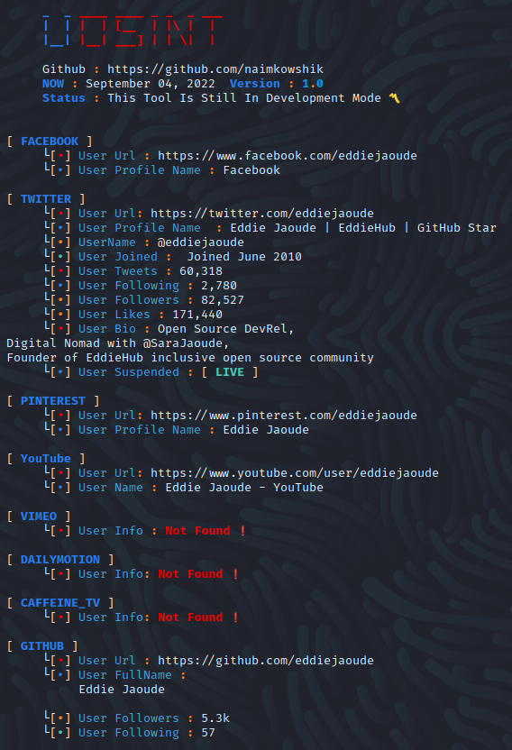

<p align=center>
  <br>
  <a target="_blank"></a></br>
</p>
<div align="center"> 
  <a href="https://github.com/sherlock-project/uosint">
    
  </a>
  <a href="https://twitter.com/K0WSHIK">
    
  </a>
  <a href="https://github.com/uosint-project/uosint/blob/master/LICENSE">
    
  </a>
</div>

<p align=center>
<span><b>Find The Profiles Of A Person On Social Networks</b></span>
<br>
<br>
<span>With this tool, you can see all the information of the target person's social networks which is publicy available. Many people thik that this tool needs to be installed, so i will make a <b>Telegram Bot</b> so that information can be obtained more easily and there no need to install or do any other probles just simple and easy.</span>
</p>

<p align=center>

</p>
<p>
<br>
<span>🍊 <b>Features</b></span>

<span>• 🔎 This can collect user information from 40+ website and more websites will be added in the future </span>

<span>• 💫 If the user's profile is <b>Lock</b> or <b>Suspended</b> or <b>Private</b>, It will also be reported</span>

<span>• 💪 Information will be collected from many website such as <b>Social Media</b>, <b>Dating Platform</b>, <b>Music</b>, <b>Programming</b>, <b>Forum</b>, <b>Entertainment</b>, <b>Porn</b>, <b>Video Share Platform</b> </span>

<span>• 📝 Sometime user write **Email** & **Phone Number** in there Bio, in that case **Email** & **Phone Number** will be **Detected** and if it is Email & Number will be search **Data Breached** & **Leaked DataBase** </span>

## Installation

```console
# clone the repo
$ git clone https://github.com/uosint-project/uosint.git

# change the working directory to uosint
$ chmod 777 uosint
$ cd uosint

# install the requirements
$ python -m pip install -r requirements.txt
```

## Usage:

you can type `-i` for help menu.

| FLAGS  | DESCRIPTION                                       | ISREQUIRED | API Required | API WebSite |
|--------|---------------------------------------------------|------------|-----|-----|
| -e     | Sometime USER write Email in there Bio, in that case you will take that Email and use -e command.                                  | Yes        | No        | No WebSite |
| -u   | Information will be collected from many website such as Social Media,Dating Platfrom,Music Platfrom,Porn, etc.                               | Yes         | No         | No WebSite |
| -n | Sometime USER write Phone Number in there Bio, in that case you will take that phoneNumber and use -n command                      | Yes         | No        | No WebSite |

To search for only one user:
```
python uosint.py -u username or --username username
```
## Description
 <span> This tool will help you to find the information of **USERNAME**. Before there are many tools that just show that the **USERNAME** is used on that website but they don't show **Name**, **Phone_Numbe**r, **Profile Photo**, **Address**, **Followers**, **Following** etc. This is different from other tools. This tool will show all the **PUBLICLY** available information on the website where the **USERNAME** is used. 
Our target in this project is to extract information from 300+ websites and we will continue to update this in the future.
</span>
  
## Screenshots
<p align=center>
  <br>
  <a target="_blank"></a></br>
</p>
  
## License

MIT © Username Open-source intelligence [ **UOSINT** ]<br/>
Original Creator - [Naim Kowshik](https://github.com/naimkowshik)

</p>

